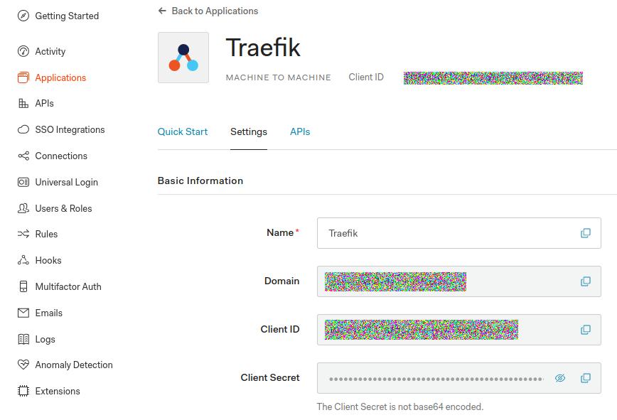
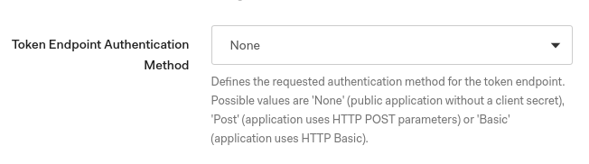
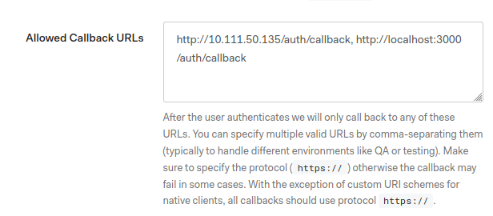
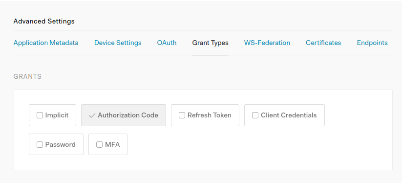
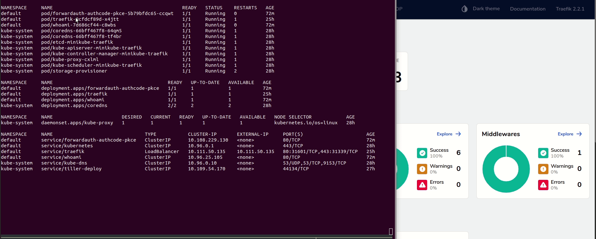

# Traefik ForwardAuth middleware for Authorization Code with PKCE flow

Simple implementation of a Traefik ForwardAuth middleware supporting Authorization Code with PKCE flow.

- Traefik documentation on ForwardAuth: <https://docs.traefik.io/middlewares/forwardauth/>
- Proof Key for Code Exchange by OAuth Public Clients: <https://tools.ietf.org/html/rfc7636>

## Prerequisites

- Kubernetes cluster (Minikube for e.g.)
- Traefik v2.x deployed (using Helm chart for e.g.: <https://docs.traefik.io/getting-started/install-traefik/#use-the-helm-chart>)
- An OIDC/OAuth 2 provider (we will use Auth0 here)

## Setup your OIDC/OAuth 2 provider

As mentioned, we pick Auth0 as our OIDC/OAuth 2.0 provider but the middleware must work with any compliant OIDC/OAuth 2.0 provider.

First step is to create a new Traefik application on Auth0. Pay attention to supported grants (we need Authorization Code), callback(s) (whitelist all URLs Auth0 may call for code exchange) and make sure Token Endpoint Authentication Method is set to `None` as we will use the PKCE extension of the Authorization Code flow, a flow well suited for public applications that cannot securely handle client secrets.









## Deploy ForwardAuth middleware

Deploy provided Kubernetes [manifest](deploy/manifest.yaml) in your cluster:

```sh
kubectl apply -f deploy/manifest.yaml
```

## Test

With manifest deployed, check Traefik Dashboard to look after our middleware on the `/whoami` route. Open a new browser tab and navigate to `http://<Traefik LoadBalancer IP>/whoami`: you should be automatically redirected to your OIDC provider's login screen to authenticate. After successful authentication you'll be redirected to the `/whoami` service. While your session is valid, you'll not have to authenticate again.



## Appendix

### Local tests without Traefik and Kubernetes

1) Two methods:
   1) Either build code locally (you need Golang installed):

    ```sh
    $ cd src
    $ go build -v -o app .

    # You can then run the ForwardAuth middleware
    $ APP_URL=https://www.google.com AUTH_CALLBACK_URL=http://localhost:3000/auth/callback OIDC_PROVIDER_URL=<Auth0 tenant URL> TRAEFIK_APP_CLIENT_ID=<app client id> ./app
    Listening on 0.0.0.0:3000
    ```

   2) Or using public image available on [Docker Hub](https://hub.docker.com/r/asaintsever/traefik-forwardauth-authcode-pkce):

    ```sh
    $ docker run --rm -e APP_URL=https://www.google.com -e AUTH_CALLBACK_URL=http://localhost:3000/auth/callback -e OIDC_PROVIDER_URL=<Auth0 tenant URL> -e TRAEFIK_APP_CLIENT_ID=<app client id> -p 3000:3000 asaintsever/traefik-forwardauth-authcode-pkce
    Listening on 0.0.0.0:3000
    ```
2) You can then perform some tests. Open your web browser and navigate to `http://localhost:3000` for e.g. You'll be redirected on Auth0 login screen and then on the app url (Google here) if authentication is ok. Meanwhile, you can see issued tokens in the console output of the ForwardAuth middleware:

```sh
2020/06/11 10:21:54 ==== New authentication request to OIDC provider
2020/06/11 10:21:54 Authorize URL: https://<Auth0 tenant URL>/authorize?client_id=<your app client id>&code_challenge=GSBnTYmwPmCVwWz8YAthCWPA-JTSL2IsMk0YLIcI0Ok&code_challenge_method=S256&redirect_uri=http%3A%2F%2Flocalhost%3A3000%2Fauth%2Fcallback&response_type=code&scope=openid+profile+email&state=6aOtpqwF8vGoNGECciA5Fcn8mrzpwAKkgiSfhxAmQyc%3D
2020/06/11 10:21:55 == ID Token: <JWT ID Token issued by Auth0>
2020/06/11 10:21:55 == Access Token: <Opaque Access Token issued by Auth0 because no audience in authorize call>
2020/06/11 10:21:55 == Profile: <ID Token claims>
...
```
